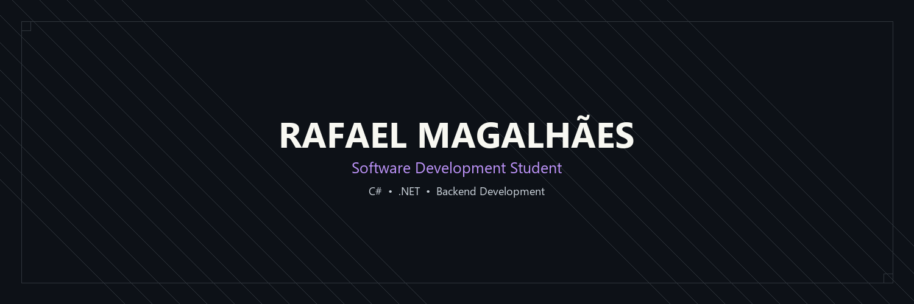

  

  <strong>Learning through projects and continuous improvement.</strong>

  Software Development Student from Brazil • C# • .NET • Backend Development

 

## About Me

I'm a Software Development student from Brazil with a strong interest in backend development.

I enjoy transforming ideas into well-structured software while continuously improving my understanding of software engineering, object-oriented programming, and clean code.

My goal is to build reliable applications, grow as a developer every day, and eventually contribute to international development teams.

 

## Tech Stack

### Languages

### Tools

 

## Currently Learning

- Object-Oriented Programming
- Clean Code
- Software Architecture
- Data Structures & Algorithms
- JSON Serialization
- Git Workflow
- .NET

 

## Featured Project

### ToDo List

A C# console application built to practice software engineering principles through continuous evolution and refactoring.

**Highlights**

- CRUD Operations
- JSON Persistence
- Object-Oriented Programming
- Input Validation
- Continuous Refactoring

 

## GitHub Statistics

 

## Roadmap

- ASP.NET Core
- Entity Framework Core
- SQL Server
- REST API Development
- Docker
- Linux
- Unit Testing
- Design Patterns
- SOLID Principles
- Open Source Contributions

 

## Contact

<!--
Future

LinkedIn

Portfolio

Professional Email
-->

 

<i>"Consistency beats intensity."</i>

